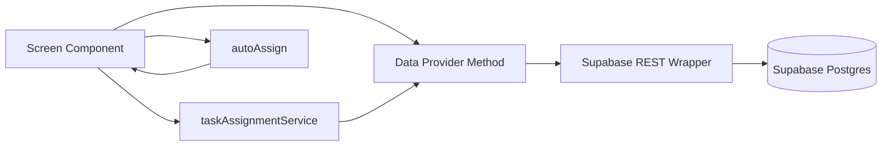

# Architecture Discovery

## 1) System architecture overview

### Frontend framework
- Next.js 15 + React 19 + TypeScript.
- Primary entrypoint: [`app/page.tsx`](../app/page.tsx) (client component shell with tab-based module switching).
- Global providers from [`app/layout.tsx`](../app/layout.tsx):
  - `ThemeProvider`
  - `DemoProvider` (tenant/role selection)
  - `MessagesProvider` (driver/customer chat mock context)

### Backend architecture
- No dedicated Node/Next backend API layer in this repo.
- No `app/api/*` endpoints.
- Browser directly calls Supabase PostgREST.

### API structure
- Effective API = Supabase REST endpoints:
  - `GET/POST/PATCH/DELETE {SUPABASE_URL}/rest/v1/<table>?...`
- Wrapper methods in [`lib/supabaseRest.ts`](../lib/supabaseRest.ts).
- Domain-specific accessors in [`data/providers/supabase/index.ts`](../data/providers/supabase/index.ts).

### Data provider pattern
- Abstraction contract: [`data/providers/IDataProvider.ts`](../data/providers/IDataProvider.ts).
- Runtime selection: [`data/index.ts`](../data/index.ts)
  - Supabase provider if `NEXT_PUBLIC_DATA_PROVIDER === "supabase"`
  - Otherwise in-memory mock provider.

### Service layer
- `services/*` mostly mock/local helper services.
- Non-trivial algorithmic modules:
  - [`services/taskAssignmentService.ts`](../services/taskAssignmentService.ts): quota-aware labor/task assignment planning.
  - [`lib/autoAssign.ts`](../lib/autoAssign.ts): delivery driver assignment by geo zone + capacity.

### Event flows (high level)

## 2) Major modules
- Platform shell and navigation: `app/page.tsx`, `components/layout/*`, `config/roleNavigation.ts`.
- Warehouse ops: `inbound`, `storage`, `inventory`, `tasks`, `orders`, `returns`, `employees` screens.
- Dispatch/delivery: `dispatcher`, `routes`, `dispatch-queue`, `drivers`, `fleet`, `mobile-driver`.
- Client views: `client-portal`, `b2b-*` screens.
- Data plane: `data/providers/*`, `lib/supabaseRest.ts`, `supabase/migrations/*`.

## 3) Service boundaries

### Boundary A: UI state and role simulation
- `DemoContext` controls active tenant/role/date; this is not auth-backed.
- Role access checks are client-side via `NAV_ITEMS` role list.

### Boundary B: Domain data access
- All CRUD/read logic centralized in provider methods (one method per domain action).
- Screens do not issue raw SQL; they call provider methods.

### Boundary C: Persistence
- Supabase Postgres schema + migrations define persistence.
- RLS disabled in migrations for app tables.

### Boundary D: Algorithmic decisioning
- Task assignment and dispatch assignment run in app runtime, not DB procedures.

## 4) State flow patterns
- Typical screen pattern:
  1. Resolve tenant (`selectedTenant.id` from context)
  2. Fetch domain records via provider
  3. Keep local React state copy
  4. On action, call provider mutation + optimistic/local state update

- Pattern exceptions:
  - Some flows are intentionally UI-only simulation (e.g., worker scan, some B2B/outbound sync claims).

## 5) Dependencies and integrations

### Runtime dependencies used in operational flows
- `react-map-gl/mapbox` + Mapbox token for map views and geocoding.
- Supabase REST API (browser-side anon key).
- Recharts for reporting views.

### External service references
- Real implementation present: Supabase, Mapbox, Vercel Analytics.
- Placeholder/marketing references: Shopify, QuickBooks, Samsara.

## 6) Architecture risks discovered
- No server-side trust boundary for business operations.
- Tenant and role controls are primarily client-driven.
- No movement/event ledger for inventory mutations.
- Multiple flows label automation/sync behavior not fully persisted.

## 7) UNKNOWN
- UNKNOWN: intended production auth enforcement path (middleware/SSO) is not present in this codebase.
- UNKNOWN: remote Supabase policy overrides not represented by checked-in migrations.
