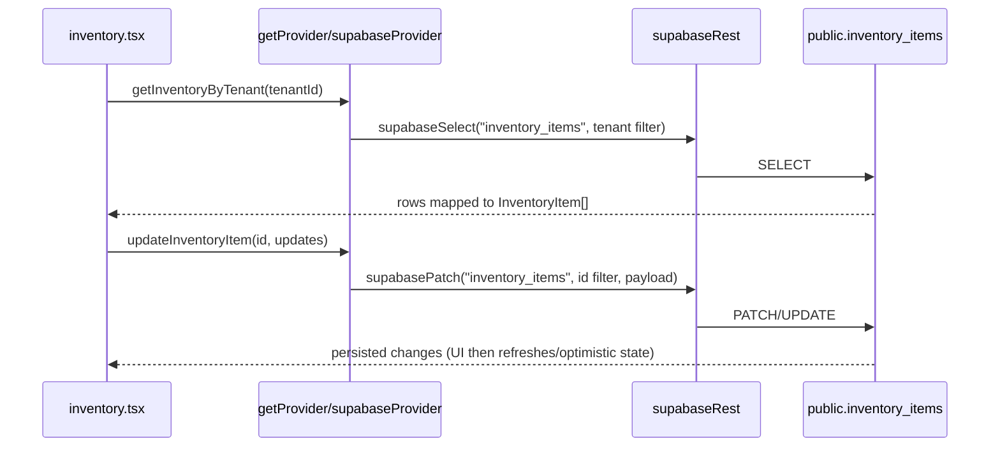
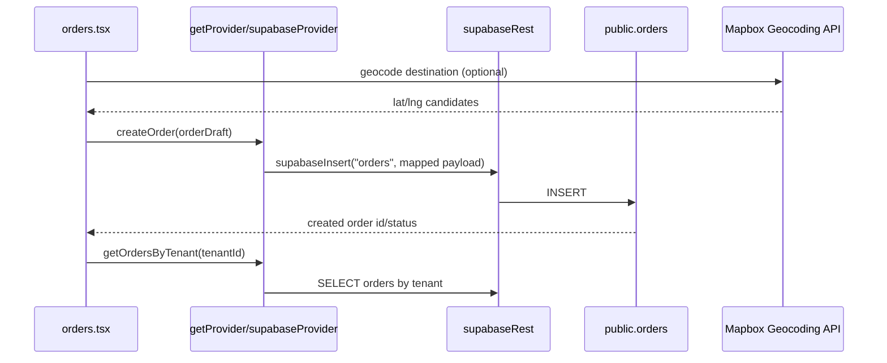
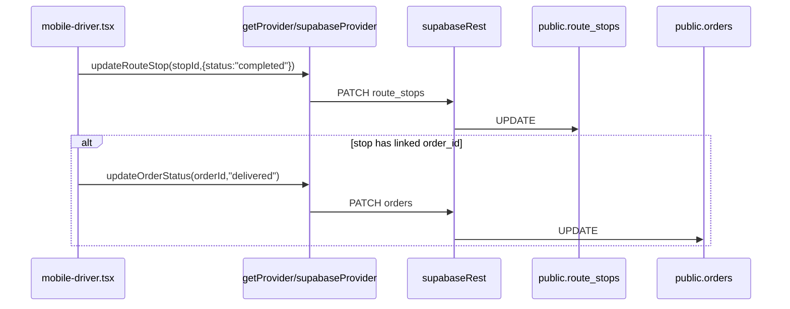

# Architecture Map

## High-level structure
- Next.js App Router routes:
  - `/` -> shell app (`app/page.tsx`) with tab-based modules.
  - `/pricing` -> standalone marketing/pricing page (`app/pricing/page.tsx`).
- Root providers in `app/layout.tsx`: `ThemeProvider`, `DemoProvider`, `MessagesProvider`.
- Data access pattern: screen -> `getProvider()` -> provider methods -> `lib/supabaseRest.ts` -> Supabase PostgREST.

## Component/data diagram
```mermaid
flowchart LR
  A[Route / app/page.tsx] --> B[Topbar + Sidebar]
  A --> C[Screen Components]

  C --> C1[orders.tsx]
  C --> C2[inventory.tsx]
  C --> C3[inbound.tsx]
  C --> C4[dispatch-queue.tsx]
  C --> C5[mobile-driver.tsx]
  C --> C6[tasks.tsx]
  C --> C7[order-reports.tsx]

  C1 --> D[getProvider()]
  C2 --> D
  C3 --> D
  C4 --> D
  C5 --> D
  C6 --> D

  D --> E[data/providers/supabase/index.ts]
  D --> F[data/providers/mock/index.ts]

  E --> G[lib/supabaseRest.ts]
  G --> H[Supabase PostgREST /rest/v1]

  H --> T1[(orders, order_lines)]
  H --> T2[(inventory_items)]
  H --> T3[(tasks)]
  H --> T4[(routes, route_stops)]
  H --> T5[(drivers, delivery_zones, vehicles)]
  H --> T6[(inbound_* tables)]
  H --> T7[(returns, return_lines)]
  H --> T8[(invoices, payments, events)]
```

## Major data flows

### 1) Inventory update flow


### 2) Order creation flow


### 3) Delivery status update flow


## Error handling approach (current)
- UI-level loading states exist in many screens (`loading` + spinner components).
- Error handling is inconsistent:
  - Some `try/catch` blocks intentionally swallow errors for demo UX (example: `components/screens/tasks.tsx`, `components/screens/mobile-driver.tsx`).
  - `lib/supabaseRest.ts` is the central place for network/request error propagation.
- Toast/central error boundary pattern: `UNKNOWN` (no consistent toast system found in scanned files).
- Retry/backoff strategy: `UNKNOWN` (no generalized retry utility found).
