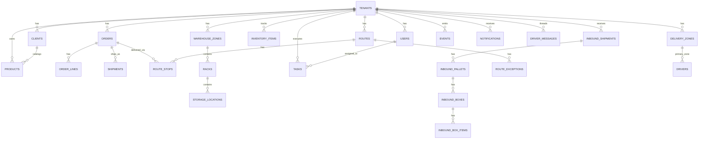

# Database Discovery

Source analyzed:
- `supabase/migrations/*.sql`
- `supabase/seed.sql`
- `data/providers/supabase/index.ts` (query behavior)

## Schema-wide observations
- Database: PostgreSQL (Supabase).
- Schema used: `public`.
- Migrations define 31 app tables.
- `tenant_id` exists on most operational tables.
- RLS is explicitly disabled across app tables in migrations.
- Several important relationships are logical only (not FK-enforced), especially in workflow fields.

## Domain grouping

## Core Entities

### `tenants`
- Purpose: master account/tenant records.
- PK: `id`
- FKs: none
- Key columns: contact/billing/storage summary fields.

### `users`
- Purpose: workforce/admin users per tenant.
- PK: `id`
- FKs: `tenant_id -> tenants.id`
- Key columns: `role`, `active`, workload fields (`daily_quota_*`, `allowed_task_types`, `default_zone`).

### `clients`
- Purpose: client accounts under a tenant (B2B customer entities).
- PK: `id`
- FKs: `tenant_id -> tenants.id`

### `products`
- Purpose: product catalog entries.
- PK: `id`
- FKs:
  - `tenant_id -> tenants.id`
  - `client_id -> clients.id` (nullable, `ON DELETE SET NULL`)
- Constraints:
  - unique index `(tenant_id, sku)`

### `locations`
- Purpose: physical facility/location records.
- PK: `id`
- FKs: `tenant_id -> tenants.id`

## Warehouse Operations

### `warehouse_zones`
- Purpose: warehouse zone topology and capacity.
- PK: `id`
- FKs: `tenant_id -> tenants.id`

### `racks`
- Purpose: rack structures in zones.
- PK: `id`
- FKs:
  - `tenant_id -> tenants.id`
  - `zone_id -> warehouse_zones.id`
- Note: `preferred_client_id` is not FK-enforced.

### `storage_locations`
- Purpose: bin/pallet slot granularity under racks.
- PK: `id`
- FKs:
  - `tenant_id -> tenants.id`
  - `zone_id -> warehouse_zones.id`
  - `rack_id -> racks.id`
- Note: `assigned_client_id` not FK-enforced.

### `tenant_storage_summaries`
- Purpose: denormalized per-client storage metrics.
- PK: `client_id`
- FKs: none
- Risk: no `tenant_id`; cross-tenant ambiguity possible.

### `putaway_suggestions`
- Purpose: suggested storage optimization actions.
- PK: `id`
- FKs: none
- Key context columns: `associated_zone_id`, `associated_rack_id`, `associated_client_id` (not FK-enforced).

## Inventory

### `inventory_items`
- Purpose: inventory snapshot by SKU/location/status.
- PK: `id`
- FKs: `tenant_id -> tenants.id`
- Key columns:
  - `qty` (pallet count)
  - `product_units` (individual units)
  - `location` string (not FK to `storage_locations`)

### `tasks`
- Purpose: operational tasks (Receive/Putaway/Pick/Pack/Return).
- PK: `id`
- FKs:
  - `tenant_id -> tenants.id`
  - `assignee_id -> users.id` (`ON DELETE SET NULL`)
- Non-enforced linkage:
  - `order_id` is text without FK by migration note.

## Orders & Fulfillment

### `orders`
- Purpose: outbound order headers.
- PK: `id`
- FKs: `tenant_id -> tenants.id`
- Key columns: status, destination, optional geocodes (`delivery_lat/lng`).

### `order_lines`
- Purpose: order line items.
- PK: `id`
- FKs: `order_id -> orders.id`

### `shipments`
- Purpose: shipment/tracking entities.
- PK: `id`
- FKs:
  - `tenant_id -> tenants.id`
  - `order_id -> orders.id` (`ON DELETE SET NULL`)

### `routes`
- Purpose: route headers.
- PK: `id`
- FKs: `tenant_id -> tenants.id`
- Non-enforced linkage: `driver_id`, `vehicle_id` are text fields (no FK).

### `route_stops`
- Purpose: route stop records.
- PK: `id`
- FKs:
  - `route_id -> routes.id`
  - `order_id -> orders.id` (`ON DELETE SET NULL`)
- Key columns: geo (`lat/lng`), `weight_kg`, `packages`, stop status.

### `route_exceptions`
- Purpose: route exception issues.
- PK: `id`
- FKs: `route_id -> routes.id`

### `drivers`
- Purpose: driver profiles.
- PK: `id`
- FKs:
  - `tenant_id -> tenants.id`
  - `zone_id -> delivery_zones.id`
- Non-enforced linkage: `vehicle_id` text, no FK.

### `delivery_zones`
- Purpose: geo delivery territories.
- PK: `id`
- FKs:
  - `tenant_id -> tenants.id`
  - `location_id -> locations.id` (nullable)

### `vehicles`
- Purpose: fleet units.
- PK: `id`
- FKs: `tenant_id -> tenants.id`
- Key columns: `max_weight_kg`, `max_packages`.

### `returns`
- Purpose: return headers.
- PK: `id`
- FKs: `tenant_id -> tenants.id`
- Non-enforced linkage: `order_id` text (no FK).

### `return_lines`
- Purpose: returned SKU lines.
- PK: `id`
- FKs: `return_id -> returns.id`

### `driver_messages`
- Purpose: dispatcher/driver conversation messages.
- PK: `id`
- FKs:
  - `tenant_id -> tenants.id`
  - `parent_id -> driver_messages.id`
- Check constraints:
  - `sender_role in ('driver','dispatcher')`
  - `status in ('unanswered','read','replied')`

## Inbound / Receiving

### `inbound_shipments`
- Purpose: inbound shipment headers.
- PK: `id`
- FKs:
  - `tenant_id -> tenants.id`
  - `client_id -> clients.id` (nullable)

### `inbound_pallets`
- Purpose: pallet-level inbound records.
- PK: `id`
- FKs:
  - `shipment_id -> inbound_shipments.id`
  - `tenant_id -> tenants.id`
  - `client_id -> clients.id` (nullable)
  - `assigned_zone_id -> warehouse_zones.id` (nullable)
  - `assigned_rack_id -> racks.id` (nullable)

### `inbound_boxes`
- Purpose: carton/box records under pallet.
- PK: `id`
- FKs: `pallet_id -> inbound_pallets.id`

### `inbound_box_items`
- Purpose: SKU quantities per inbound box.
- PK: `id`
- FKs: `box_id -> inbound_boxes.id`
- Note: `sku` is text only, no FK to `products`.

## Billing / Finance

### `invoices`
- Purpose: invoice headers.
- PK: `id`
- FKs: `tenant_id -> tenants.id`

### `payments`
- Purpose: payment/usage charge records.
- PK: `id`
- FKs:
  - `tenant_id -> tenants.id`
  - `client_id -> clients.id` (`ON DELETE SET NULL`)
- Key column: `metadata jsonb`.

## Events / Notifications

### `events`
- Purpose: generic event intake/audit log.
- PK: `id`
- FKs: `tenant_id -> tenants.id`
- Key columns: `source`, `event_type`, `payload jsonb`, `received_at`.

### `notifications`
- Purpose: UI/system notifications.
- PK: `id`
- FKs: `tenant_id -> tenants.id`

## Relationship map (high level)

## Integrity gaps and modeling notes
- `tasks.order_id` not FK-enforced by design (explicit in migration comment).
- `returns.order_id` not FK-enforced.
- `routes.driver_id` and `routes.vehicle_id` not FK-enforced.
- `inventory_items.location` and `inventory_items.client` are text labels, not FK references.
- `putaway_suggestions` linkage fields are advisory text IDs, not enforced.
- `tenant_storage_summaries` lacks `tenant_id`; isolation semantics are ambiguous.

## RLS and tenancy controls
- All core tables are created with RLS disabled in migrations.
- No policy DDL found in migrations.

## UNKNOWN
- UNKNOWN: remote Supabase project may have manually created policies or constraints not in repo migrations.
