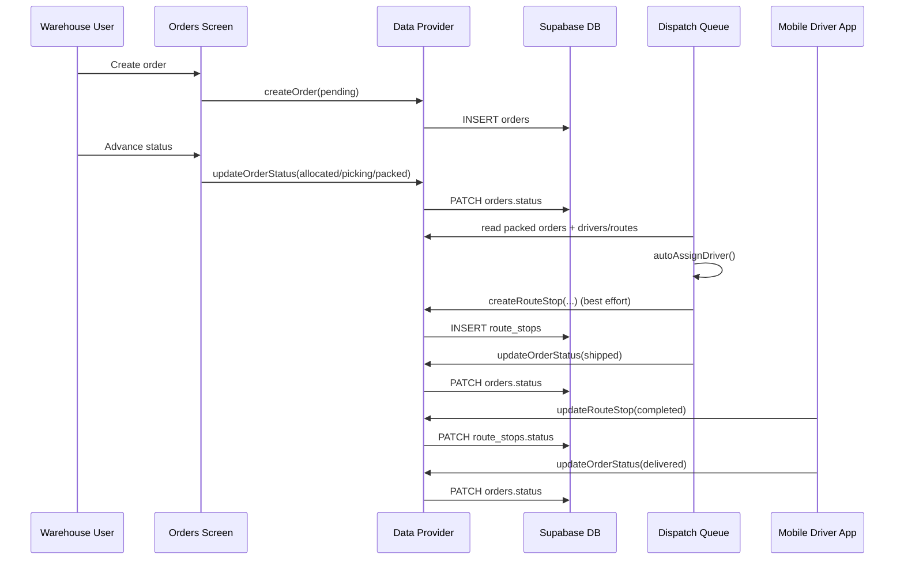
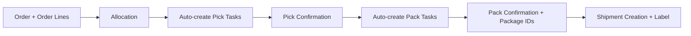

# Order & Fulfillment Flow Discovery

## Lifecycle found in code
Status model in app/types:
- `pending -> allocated -> picking -> packed -> shipped -> delivered`

Primary interaction points:
- Order management screen (create + advance statuses)
- Dispatch queue (assign/dispatch packed orders)
- Mobile driver app (complete stop -> delivered)

## 1) Order creation
Current path:
- UI form in Orders screen calls `api.orders.createOrder({...status:'pending'})`.
- Persisted to `orders` table.
- Order lines entered in modal are currently not persisted to `order_lines` in this flow.

## 2) Picking
Current path:
- Status advancement is manual via `updateOrderStatus` (`pending -> allocated -> picking`).
- No automatic generation of pick tasks from order lines in the observed order flow.

## 3) Packing
Current path:
- Manual status advancement (`picking -> packed`).
- No pack confirmation artifact table (e.g., package IDs) found.

## 4) Shipment / dispatch
Current path:
- Dispatch queue loads orders with statuses `packed|shipped|delivered`.
- Auto-assign algorithm recommends driver by zone/capacity.
- On dispatch action:
  - best-effort create `route_stops` row (if route exists for chosen driver)
  - set `orders.status='shipped'`

## 5) Delivery completion
Current path:
- Mobile driver app marks route stop `status='completed'`.
- If stop has `orderId`, app sets linked order status to `delivered`.

## Sequence diagrams

### Current implementation sequence: Order -> Pick -> Pack -> Ship -> Deliver

### Expected but currently missing automated subflow

## Data artifacts used
- `orders`
- `order_lines` (read/display, not consistently created in UI flow)
- `shipments` (read for shipped orders)
- `routes`, `route_stops`
- `tasks` (separate module; not tightly coupled to order lifecycle transitions)

## Noted behavioral gaps
- Order-line persistence during order creation flow is incomplete.
- Pick/pack task generation is not wired from order transitions.
- Inventory reservation/deduction not tied to order lifecycle state changes.
- Dispatch/route workflow is partially optimistic in UI.

## UNKNOWN
- UNKNOWN: external process may be creating `order_lines`, `shipments`, or tasks outside the UI flow observed here.
