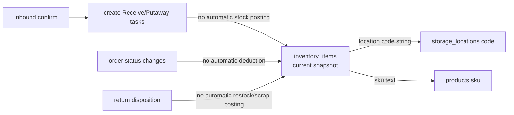

# Inventory Model Discovery

## 1) Where inventory is stored
Primary table: `inventory_items`

Key fields:
- `id` (PK)
- `tenant_id`
- `sku`
- `name`
- `location` (string code)
- `status` (`available|reserved|quarantined|pending_receive|picked` in app model)
- `qty` (pallet count)
- `product_units` (individual units)
- `min_stock`
- `client` (string label)

## 2) Inventory-related tables in broader model
- `inventory_items` (current-state snapshot)
- `storage_locations` (capacity/slot occupancy, not directly tied by FK from inventory row)
- `inbound_*` tables (expected/received content staging)
- `tasks` (operational work, not inventory ledger)
- `events` (generic event log, not guaranteed inventory movement ledger)

## 3) Mutation surfaces (code)

### Persisted mutations
- Provider methods:
  - `createInventoryItem`
  - `updateInventoryItem`
  - `deleteInventoryItem`
- Inventory transfer UI updates `inventory_items.location` only.
- Quantity changes are direct field edits (`qty`, `product_units`), no movement record.

### Non-mutations where inventory might be expected but not persisted
- Inbound “Confirm Inbound & Create Tasks” creates tasks, but does not persist inventory receipt quantities.
- Returns completion updates return disposition, but does not adjust inventory automatically.
- Order lifecycle transitions (`allocated/picking/packed/shipped/delivered`) do not auto-mutate inventory quantities in current code.
- Mobile worker scan/complete flow is UI simulation; no persistent stock deduction in that screen.

## 4) Stock movement logic
Current pattern:
- Snapshot overwrite model (state-in-place updates).
- No immutable stock transaction table.
- No event-sourced movement chain (receive, move, reserve, pick, adjust) with before/after values.

Implications:
- Hard to audit historical stock movements.
- Hard to reconcile discrepancies.
- Hard to support barcode-driven receiving confidence checks.

## 5) Adjustment flows discovered

### Manual adjustment (Inventory screen)
- User edits item values in form.
- App calls `api.inventory.updateInventoryItem(id, updates)`.
- DB row overwritten directly.

### Transfer flow
- User selects item + new location.
- App calls `updateInventoryItem(itemId, { location })`.
- No corresponding `storage_locations.current_pallets` transactional adjustment in same operation.

### Deletion flow
- `deleteInventoryItem(id)` physically deletes row.
- No archive/deactivation model.

## 6) Warehouse/location hierarchy impact
Logical hierarchy in storage model:
- `warehouse_zones -> racks -> storage_locations`

Inventory linkage reality:
- Inventory references location via free-text `location` code.
- No FK from `inventory_items.location` to `storage_locations.code`.
- Consistency is convention-based, not constraint-enforced.

## 7) Diagram

## 8) Inventory model strengths
- Simple and fast for dashboard-style visibility.
- Supports tenant filtering and status segmentation.
- Supports dual count concept (`qty` pallets + `product_units`).

## 9) Inventory model limitations
- Missing stock ledger/movement table.
- Missing reservation/allocation detail model.
- Missing transactional coupling between location occupancy and stock moves.
- Missing receiving reconciliation model (expected vs received vs variance).

## UNKNOWN
- UNKNOWN: whether external services post inventory adjustments directly to database outside this app.
