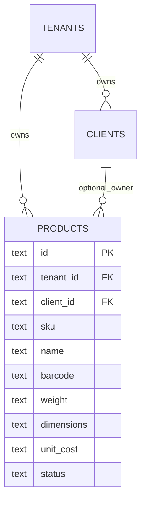
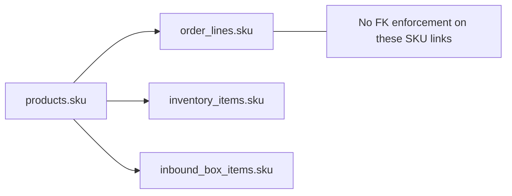

# Product Model Discovery

## Canonical persisted product entity
Table: `products`

Columns (persisted):
- `id` (PK)
- `tenant_id` (FK -> tenants)
- `client_id` (FK -> clients, nullable)
- `sku` (required, unique with tenant)
- `name`
- `barcode` (single optional text field)
- `weight` (text)
- `dimensions` (text)
- `unit_cost` (text)
- `status` (`active|inactive|discontinued` in app model)

Constraint:
- unique `(tenant_id, sku)`

## SKU structure
- SKU is tenant-scoped unique key in DB.
- No schema-enforced SKU format pattern (alphanumeric format is convention only).

## Barcode storage
- Barcode is a single field on `products.barcode`.
- No separate barcode table.
- No barcode type discriminator (UPC/EAN/GTIN/etc).
- No validity ranges/effective dates.

## Product-to-other-domain linkages
- Orders use `order_lines.sku` text; no FK to products.
- Inventory uses `inventory_items.sku` text; no FK to products.
- Inbound box items use `inbound_box_items.sku` text; no FK to products.

Implication:
- Referential integrity for SKU usage is application-level only.

## Packaging / variants / UOM status
Persisted core model:
- No product variant table.
- No UOM/pack-size conversion table.
- No case-inner-each hierarchy table.

UI/demo-only model:
- `B2BProduct` type includes `unitsPerCase`, `sellPrice`, `minStock`, `currentStock`.
- B2B product screen currently uses local state/mock, not persisted via provider.

## Supplier identifiers
- No dedicated supplier table or supplier SKU mapping table found.
- `inbound_shipments.reference_number` acts as inbound reference only, not supplier master.
- Purchase-order linkage: not present.

## Client-specific catalogs
- Yes, partially supported by `products.client_id`.
- Provider supports:
  - `getProductsByTenant(tenantId)`
  - `getProductsByClient(tenantId, clientId)`
  - `getProductBySku(tenantId, sku)`

## Relationship diagrams

## Current assumptions embedded in code
- One product has at most one barcode.
- SKU text matching is sufficient for joins across modules.
- Physical attributes are strings, not structured numeric dimensions/UOM.

## Gaps relevant to Smart Receiving
- Missing universal barcode alias/multi-barcode support.
- Missing canonical UOM and package conversion model.
- Missing supplier item identity layer.
- Missing robust SKU referential integrity across order/inventory/inbound tables.

## UNKNOWN
- UNKNOWN: any external PIM/catalog service feeding products outside this repository.
