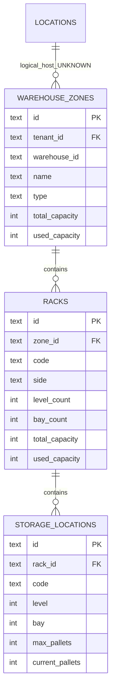

# Warehouse Structure Discovery

## 1) Warehouse entities

### `locations`
- Represents physical sites (warehouse/distribution/staging/other).
- Fields: `id`, `tenant_id`, `name`, `address`, `type`.

### `warehouse_zones`
- Represents logical storage zones inside a warehouse.
- Fields include `warehouse_id`, `name`, `type`, `total_capacity`, `used_capacity`.
- Zone types used in app model: `reserve`, `forward_pick`, `returns`, `overflow`, `staging`.

### `racks`
- Child of zone.
- Structural fields: `side`, `level_count`, `bay_count`.
- Capacity fields: `total_capacity`, `used_capacity`.
- Optional `preferred_client_id` convention.

### `storage_locations`
- Slot-level granularity under rack.
- Fields: `code`, `level`, `bay`, `type`, `max_pallets`, `current_pallets`, `utilization_percent`, `assigned_client_id`.

## 2) Hierarchy model

Note:
- `warehouse_zones.warehouse_id` is text and not FK-enforced to `locations.id`.
- Relationship `locations <-> warehouse_zones` is therefore logical, not enforced.

## 3) Location coding and barcode posture
- Location identification uses text codes (examples: `R-01-A-1-1`, `FP-01-A-1-1`).
- No dedicated `location_barcodes` table.
- No explicit barcode symbology/type metadata for locations.
- Current scanning screens are mostly simulation; no persisted scan-to-location event model found.

## 4) Capacity constraints
Stored as fields:
- Zone: `total_capacity`, `used_capacity`
- Rack: `total_capacity`, `used_capacity`
- Slot: `max_pallets`, `current_pallets`, `utilization_percent`

Observed enforcement:
- No DB triggers/checks enforcing capacity limits during mutations.
- UI uses these values for analytics, alerts, and suggestions.

## 5) Putaway logic
Current mechanism is advisory + task generation:
- `putaway_suggestions` provides suggestion type/priority and associated zone/rack/client references.
- Inbound pallet records may already include `assigned_zone_id`, `assigned_rack_id`, `assigned_location_code`.
- Inbound confirm action generates Putaway tasks per pallet.
- No strong persisted putaway execution transaction that atomically:
  - moves pallet from dock/staging to location,
  - updates `storage_locations.current_pallets`,
  - updates `inventory_items.location/qty`,
  - records movement history.

## 6) UI operational coverage
- Warehouse settings screen supports CRUD for zones/racks.
- Storage screen shows occupancy, client fragmentation, rack/slot data, and suggestion actions.
- Inbound screen uses rack/zone context to display expected putaway placement.

## 7) Structural gaps for advanced warehouse execution
- No explicit aisle entity.
- No bin-depth or volumetric capacity model.
- No slot attribute model (temperature/hazmat/weight class/ABC velocity).
- No serialized pallet/license plate tracking table.

## UNKNOWN
- UNKNOWN: intended long-term mapping between `locations` and `warehouse_zones.warehouse_id`.
